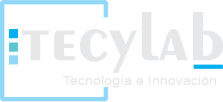

# NestJS AWS Serverless Workshop

Workshop práctico sobre desarrollo serverless con NestJS y AWS Lambda.

## Requisitos Previos

- Node.js v18 o superior
- AWS CLI configurado
- Editor de código (VS Code recomendado)
- Git instalado
- Cuenta AWS activa
- Conocimientos básicos de TypeScript

## Estructura del Workshop

1. Introducción a Serverless y AWS Lambda
2. Configuración del entorno
3. Desarrollo con AWS Lambda y NestJS
4. Servicios AWS y patrones
5. Despliegue y mejores prácticas

## Cómo usar este repositorio

1. Las slides se encuentran en la carpeta `/slides`
2. El código de demostración está en `/demo`
   `

## Configuración Inicial

1. Clonar el repositorio
2. Instalar dependencias
3. Configurar AWS CLI

## Recursos Adicionales

1. Documentación AWS Lambda [AWS Lambda](https://docs.aws.amazon.com/lambda/).
2. NestJS Docs [NestJS](https://docs.nestjs.com)
3. Serverless Framework Docs [Serverless](https://www.serverless.com/framework/docs)

## Licencia

MIT
